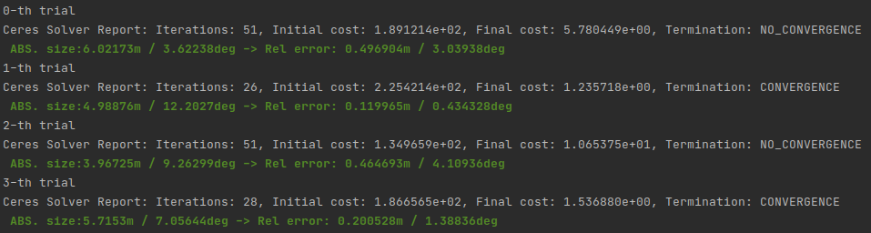

# Hello Ceres! (한글.ver)

Original author: Hyungtae Lim (shapelim@kaist.ac.kr)  

---

## C++의 optimization library인 Ceres Solver에 대한 Tutorial

수식적으로 optimization이나 C++ 문법에 대한 상세한 설명보다는 오롯이 **어떻게 쓰는지**에 대한 tutorial

### Tutorial의 목적

Graph SLAM의 optimization 부분이 친근하지 않은 분들께 설명을 위한 자료입니다. 이론 상으로 Graph SLAM을 공부하면 엄청난 수식(?)들에 압도당하기 쉬운데, 사실 non-linear optimization을 Ceres가 해주고 Error term도 Ceres에서 이미 `examples/slam/pose_graph_2d`와 `examples/slam/pose_graph_3d` 경로에 있기 때문에 저희는 사용만 하면 됩니다. :) 

이 레포지토리는 Graph SLAM을 low-level부터 짜고 싶은데, C++ 코드에 익숙치 않아 어려움을 겪으시는 분들께 도움이 될것이라 생각합니다. Step-by-step으로 Ceres Solver를 어떻게 사용하는지 설명드릴 예정입니다.

---

## Ceres 설치

http://ceres-solver.org/installation.html 을 따라 하면 된다

### Compile

<pre><code>$ cmake CMakeLists.txt</code></pre>
<pre><code>$ make</code></pre>

### 실행

<pre><code>$ ./${compiled filename}</code></pre>

### 코드 구성

### 주의

