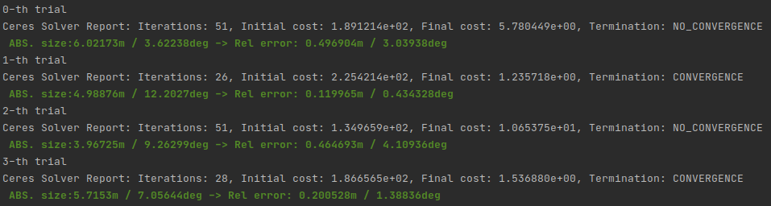

<div align="center">

<h1>Hello Ceres! (한글.ver)</h1>


<p><strong><em>A step-by-step Ceres Solver tutorial for Graph SLAM, in Korean.</em></strong></p>

</div>

Original author: Hyungtae Lim (shapelim@kaist.ac.kr)

______________________________________________________________________

## :rocket: Overview

C++의 optimization library인 Ceres Solver에 대한 Tutorial입니다.

수식적으로 optimization이나 C++ 문법에 대한 상세한 설명보다는 오롯이 **어떻게 쓰는지**에 대한 tutorial입니다.

Graph SLAM의 optimization 부분이 친근하지 않은 분들께 설명을 위한 자료입니다. 이론 상으로 Graph SLAM을 공부하면 엄청난 수식(?)들에 압도당하기 쉬운데, 사실 non-linear optimization을 Ceres가 해주고 Error term도 Ceres에서 이미 `examples/slam/pose_graph_2d`와 `examples/slam/pose_graph_3d` 경로에 있기 때문에 저희는 사용만 하면 됩니다. :)

이 레포지토리는 Graph SLAM을 low-level부터 짜고 싶은데, C++ 코드에 익숙치 않아 어려움을 겪으시는 분들께 도움이 될것이라 생각합니다. Step-by-step으로 Ceres Solver를 어떻게 사용하는지 설명드릴 예정입니다.

______________________________________________________________________

## :books: Table of Contents

* **EX 1**: [helloworld.cc](https://github.com/LimHyungTae/helloceres/blob/master/helloworld.cc): 가장 간단한 예시
* **EX 2-1**: [add_residual_1.cc](https://github.com/LimHyungTae/helloceres/blob/master/add_residual_1.cc): 추가적인 CostFunctor 만들기
* **EX 2-2**: [add_residual_2.cc](https://github.com/LimHyungTae/helloceres/blob/master/add_residual_2.cc): 여러 CostFunctor를 하나의 cost function으로 합치기
* **EX 3**: [multivariate.cc](https://github.com/LimHyungTae/helloceres/blob/master/multivariate.cc): 다변수를 인풋으로 받는 방법
* **EX 4-1**: [helloceres_pose_2d.cc](https://github.com/LimHyungTae/helloceres/blob/master/helloceres_pose_2d.cc): 두 2D 상의 pose들 최적화하기
* **EX 4-2**: [helloceres_pose_2d_fixed_a.cc](https://github.com/LimHyungTae/helloceres/blob/HEAD/helloceres_pose_2d_fixed_a.cc): 변수 고정하는 방법 (잘 쓰이지 않음)
* **EX 4-3**: [helloceres_pose_2d_fixed_b.cc](https://github.com/LimHyungTae/helloceres/blob/HEAD/helloceres_pose_2d_fixed_a.cc): 변수 고정하는 방법 (일반적인 방식)
* **EX-5**: ...

______________________________________________________________________

## :hammer: Build

### Local (macOS / Linux)

```bash
cmake -B build -S . -DCMAKE_BUILD_TYPE=Release
cmake --build build -j$(nproc)
```

> **macOS note (Anaconda users):** If you have Anaconda installed alongside Homebrew, pin the Homebrew dependencies explicitly to avoid a gflags/glog conflict:
> ```bash
> cmake -B build -S . -DCMAKE_BUILD_TYPE=Release \
>       -DCMAKE_BUILD_RPATH=/opt/homebrew/lib \
>       -DCMAKE_IGNORE_PATH=/opt/anaconda3/lib \
>       -Dgflags_DIR=/opt/homebrew/lib/cmake/gflags \
>       -Dglog_DIR=/opt/homebrew/lib/cmake/glog
> ```

### Docker (Ubuntu 22.04 or 24.04)

```bash
# Ubuntu 22.04
docker build --build-arg UBUNTU_VER=22.04 -t helloceres:ubuntu22 .
docker run --rm helloceres:ubuntu22

# Ubuntu 24.04
docker build --build-arg UBUNTU_VER=24.04 -t helloceres:ubuntu24 .
docker run --rm helloceres:ubuntu24
```

______________________________________________________________________

## :test_tube: Test

```bash
bash scripts/run_tests.sh build   # or build_mac on macOS
```

______________________________________________________________________

## :warning: Note


